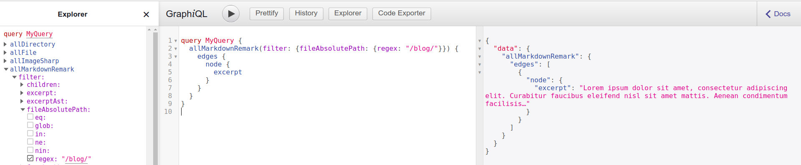

**Just a test**

Today is Christmas, and I'm Jewish. For me, this means I'm likely to use my day off to accomplish something that I've been putting off for a long time. And this year, I'm turning that into a Christmas gift for you all! You see, I've been seriously procastinating on a couple things: 1. putting together a personal site that includes a blog, and 2. building something with Gatsby.

Well, I'm pleased to inform you that Gatsby and NetlifyCMS made my life pretty easy here, but nonetheless, I learned some things that I think are worth sharing. And since it's customary for a developer's first personal blog post to focus on the process of building their blog, today I'm going to use my first blog post to show you how you can create yours!

## How a static blog is built

Gatsby produces static sites, which are made up of static pages. That means that your blog content is built into those pages _at build time_. The details of how this works will vary depending on what CMS you use, but **in the case of NetlifyCMS, your blog content is ultimately stored in the same file system as the application code when your site is built**. This is an important point that I wish I'd understood earlier on in the process, because knowing this fact can make it much easier to experiment during development. More on this later!

For now, know this: whether you're using one of Gatsby's excellent themes to create your blog or rolling your own, the inner workings are the same!

1. You'll use [gatsby-source-filesystem][gsf] to allow Gatsby to pull in your blog content via GraphQL.
1. You'll have Markdown files in the same folder that you've specified in your gatsby-source-filesystem configuration.
1. You'll use [gatsby-transformer-remark][transform] to convert those Markdown files into HTML and frontmatter data.
1. You'll use a [GraphQL query][index query] to list all of your blog posts on an index page.
1. You'll use [gatsby-node][gatsby-node] and GraphQL to generate a page for each blog post, [using a template][template] to control how they are rendered.

### ♫ I've got no themes, to hold me down... ♫


I decided not to use a theme, so I ended up following the guides from the steps above, and I really didn't have to change much. The docs are quite good! But there were some minor differences, dots connected, and lessons learned as I went through the process, which is what I want to focus on in this post. So let's have a look inside my blog!

## Using NetlifyCMS

With NetlifyCMS, it's easy to integrate your content management UI into your static site. If you [follow the instructions][source from netlify] in the Gatsby docs, it shouldn't take long before you're able to access an admin page that lets you create, edit, and delete entries across multiple collections. There are a couple pieces that threw me for a loop, though: getting content into my local build, getting it to display how I wanted, and using multiple collections.

### Using your content in development

When you create a new entry through the admin interface and publish it, that entry gets pushed to your project's GitHub repository (or GitLab, etc), and more specifically, the file will be added to the folder that's specified for that collection in `static/admin/config.yml`. When I first got my NetlifyCMS integration working, that folder did not yet exist in GitHub, so I was unable to publish.

You can't create empty folders in GitHub either, so to get around this, I did something that was silly in hindsight: I created a text file in that folder, and another one in the folder that I'd specified as my `media_folder`, which is where the CMS will try to upload any images that you add through the admin UI. Once those were created, I was able to publish entries. However, those entries were not available to me in my local build unless I rebased my local branch against master. This doesn't make for a great feedback loop if you're making a lot of changes to the content as you develop to see how things will look locally! After some time, though, I realized that there's a much smarter way to do this.

Remember when I said that all of your blog content ultimately comes from your file system? I hadn't connected the dots at first, but this became clear after a couple cycles of publishing and rebasing. So for your first post, why not cut out the middle altogether? Just create some Markdown files in your local collection folder and make sure they're formatted correctly, and your Gatsby site will rebuild every time you save an edit to that file. This makes for much faster iteration while you're figuring out what you want to do with your content -- in fact, I'm using that technique right now to write this post! Once everything is the way you want it, using the admin UI to manage your content will make a lot more sense.

### Displaying your content correctly

The other thing that wasn't obvious to me at first is that some fields are special. Specifically, the `body` field is treated differently than other fields. When you define that field in your collection, it gets treated as (surprise) the _body_ of your post, whereas all other fields are treated as frontmatter.

Frontmatter fields are useful for declaring data like titles and dates that you might want to display separately from the body, or use for sorting or filtering. What's more, any of these fields can be configured to use a Markdown widget. So when I defined my first collection, I tried to use a field by a different name to contain the Markdown content that I wanted to display, and because of that, I wasn't able to display it in the way that the docs demonstrated. I wound up installing `react-markdown` to display the contents of that field, but after reviewing some more examples, I eventually realized my error and updated my collection definition to use the `body` field for my Markdown content. At that point, my solution matched up with the docs.

### Using multiple collections

The obstacle here isn't really with NetlifyCMS. The real problem is that the [gatsby-source-filesystem][gsf] docs don't really demonstrate how to deal with it. On one hand, it seemed pretty obvious that I'd have to create two entries in `gatsby-config.js`:

```js
    {
      resolve: `gatsby-source-filesystem`,
      options: {
        name: `projects`,
        path: `${__dirname}/projects`,
      },
    },
    {
      resolve: `gatsby-source-filesystem`,
      options: {
        name: `blog`,
        path: `${__dirname}/blog`,
      },
    },
```

But with both of these defined, you'll hit a brick wall as soon as you run the GraphQL query that they show in the docs:

```graphql
query {
  allMarkdownRemark(sort: { order: DESC, fields: [frontmatter___date] }) {
    edges {
      node {
        id
        excerpt(pruneLength: 250)
        frontmatter {
          date(formatString: "MMMM DD, YYYY")
          path
          title
        }
      }
    }
  }
}
```

That's because querying `allMarkdownRemark` without any filters is going to give me the entries from both of my collections! So I went to the GraphiQL explorer to see what my options were when making this query.



It turned out that I could add a filter on the file path, which allowed me to specify a regular expression. This showed me the syntax I needed to form the query that I'm currently using on my blog index page:

```graphql
query {
  allMarkdownRemark(
    sort: { order: DESC, fields: [frontmatter___date] }
    filter: { fileAbsolutePath: { regex: "/blog/" } }
  ) {
    edges {
      node {
        id
        excerpt(pruneLength: 450)
        frontmatter {
          date(formatString: "MMMM DD, YYYY")
          path
          title
        }
      }
    }
  }
}
```

## Them code snippets though...

So how about those nice looking code blocks? Those don't quite come right out of the box; you'll get the formatting, but for the rich highlighting experience, I used [gatsby-remark-prismjs][prism]. Fortunately, this is one of the simpler parts of the story. After installing the plugin, it really only required two steps. First, I had to change how `gatsby-transformer-remark` was configured in order to hook PrismJS into it:

```js
    {
      resolve: `gatsby-transformer-remark`,
      options: {
        plugins: [`gatsby-remark-prismjs`],
      },
    },
```

The next step is to include the CSS for your preferred PrismJS theme. That's just one line of code in your `gatsby-browser.js` file:

```js
require("prismjs/themes/prism-okaidia.css");
```

That's it! Now I can insert fenced code blocks into my Markdown files, specify a language after the opening backticks, and then my posts will display nicely highlighted code snippets.

## Yep, that's really it

In summary, Gatsby and NetlifyCMS made the process of building a blog about as easy as I could've hoped for. There were a few things to trip over and some lessons to learn, so I've written this post in hopes that you will have an even easier time than I did. Here are the main points:

1. In development, your blog content comes from your local filesystem. In the beginning, it's easier to create your Markdown files by hand while you iterate on the code that displays your content. The CMS will come in handy once you have everything right.
1. In your content model, use the `body` field for the body of your post. The other fields are for frontmatter data.
1. If you have more than one collection, you can use filtering in your GraphQL queries to make sure that you only get the Markdown files from the folder that you want.
1. To get nice highlighting in your code snippets, [Gatsby has a plugin][prism] for PrismJS that you can integrate into your Markdown transformation tooling.

[gsf]: https://www.gatsbyjs.org/docs/adding-markdown-pages/#read-files-into-gatsby-from-the-filesystem
[transform]: https://www.gatsbyjs.org/docs/adding-markdown-pages/#transform-markdown-to-html-and-frontmatter-to-data-using-gatsby-transformer-remark
[index query]: https://www.gatsbyjs.org/docs/adding-a-list-of-markdown-blog-posts/#creating-the-graphql-query
[gatsby-node]: https://www.gatsbyjs.org/docs/adding-markdown-pages/#create-static-pages-using-gatsbys-nodejs-createpage-api
[template]: https://www.gatsbyjs.org/docs/adding-markdown-pages/#create-a-page-template-for-the-markdown-files
[source from netlify]: https://www.gatsbyjs.org/docs/sourcing-from-netlify-cms/
[prism]: https://www.gatsbyjs.org/packages/gatsby-remark-prismjs/
